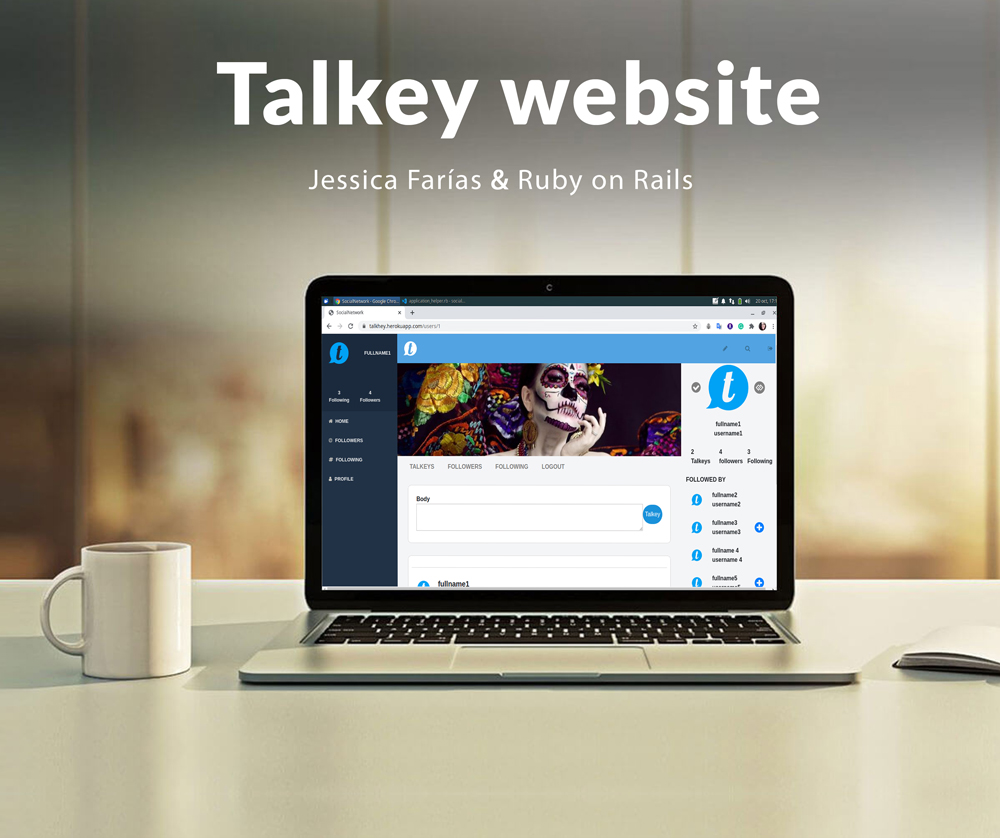

# Talkey for social media app with Ruby on Rails

This Project is an app built using Ruby on Rails basic functionalities of a social network similar to Twitter but using a different interface.

## Built With

- Ruby v2.7.0
- Ruby on Rails v5.2.4

## Live Demo on Heroku

[Talkhey](https://talkhey.herokuapp.com/login)


## Getting Started

To get a local copy up and running follow these simple example steps.

### Prerequisites

Ruby: 2.7.1
Rails: 6.0.0
Postgres: >=9.5

### Setup

Instal gems with:

```
bundle install
```

Setup database with:

```
   rails db:create
   rails db:migrate
```


## Features:
* Ruby 2.7.0
* Rubocop
* Ruby Gems
* Postgresql
* Rspec
* Capybara


### Usage

Start local server with:

```
    rails server
```

Open `http://localhost:3000/` in your browser.

### Run tests

```
    rpsec --format documentation
```

> Tests will be added by Microverse students. There are no tests for initial features in order to make sure that students write all tests from scratch.

### Milestone 1




## Testing
* Run from your terminal to test the project<pre><code> rspec </code></pre>

## Ruby Gems used in this project

* [Bootstrap](https://getbootstrap.com/) - SCSS Framework
* [Font-Awesome](https://fontawesome.com/) - For SASS icons

👤 **Jessica Farias**

- Github: [jessicafarias](https://github.com/jessicafarias)
- Twitter: [@FariasRosado](https://twitter.com/FariasRosado)
- Linkedin: [jessica-michelle-farias-rosado](https://www.linkedin.com/in/jessica-michelle-farias-rosado/)

## 🤝 Contributing

Contributions, issues and feature requests are welcome!

Feel free to check the [issues page](issues/).

## Show your support

Give a ⭐️ if you like this project!
